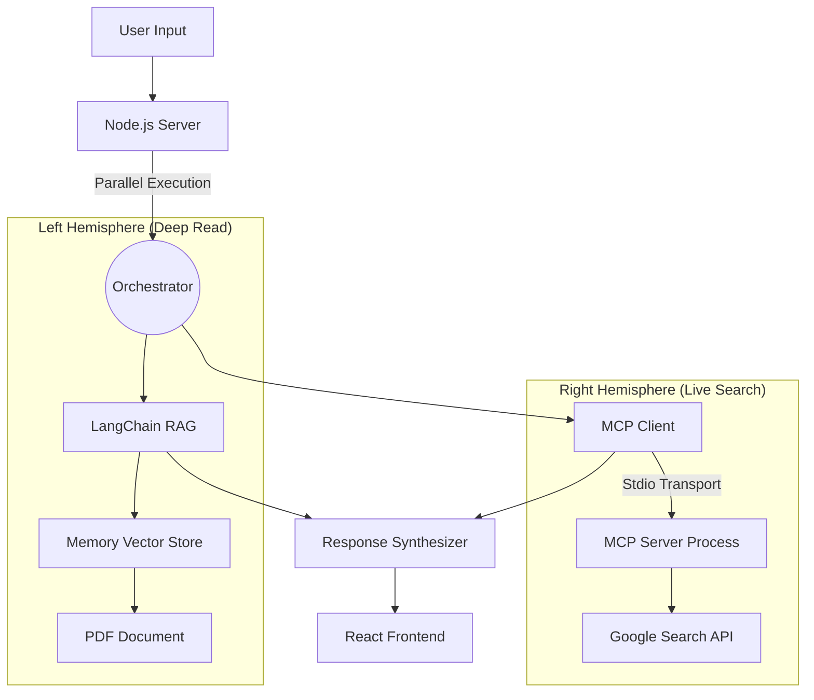

# 🧠 Hemisphere AI

> **Bridging Static Knowledge and Dynamic Intelligence.** > *A dual-brained agent architecture powered by RAG and Model Context Protocol (MCP).*


---

## 📖 The Philosophy

In cognitive neuroscience, the human brain operates through two distinct yet interconnected hemispheres. **Hemisphere AI** mimics this biological architecture to overcome the limitations of traditional Large Language Models (LLMs):

* **The Left Hemisphere (Recall & Logic):** Dedicated to **Retrieval-Augmented Generation (RAG)**. It deeply analyzes local, private knowledge (PDFs) with zero hallucinations, acting as the rigorous academic.
* **The Right Hemisphere (Exploration & Perception):** Dedicated to **Real-Time Web Search**. Utilizing the **Model Context Protocol (MCP)** and SerpAPI, it explores the live internet for up-to-the-second information, acting as the dynamic reporter.

By running these processes in parallel, Hemisphere AI provides a holistic answer that neither a simple document reader nor a standard chatbot can achieve alone.

## 🏗️ System Architecture


## ✨ Key Features

* **⚡ Parallel Dual-Processing**: Leveraging Node.js asynchronous capabilities (`Promise.all`), both "brains" work simultaneously, cutting response time in half compared to sequential processing.
* **📚 Private Document RAG**: Upload and chat with complex PDF documents. The system uses recursive text splitting and vector embeddings for precise context retrieval.
* **🌐 MCP-Powered Web Search**: Implements the cutting-edge **Model Context Protocol** (Client-Server architecture) to decouple the search logic from the main application flow.
* **🗣️ Full Voice Interaction**:
    * **STT (Speech-to-Text)**: Continuous dictation support.
    * **TTS (Text-to-Speech)**: The AI reads responses aloud, creating a seamless conversational experience.
* **UI**: Built with React and Ant Design, featuring a clean, responsive layout with visual indicators for different knowledge sources.

## 🛠️ Tech Stack

* **Frontend**: React, Ant Design, Axios, SpeechRecognition API
* **Backend**: Express.js, Multer
* **AI Orchestration**: LangChain.js
* **Protocols**: Model Context Protocol (MCP SDK)
* **Models & APIs**: OpenAI GPT-4o, SerpAPI

## 🚀 Getting Started

### Prerequisites
* Node.js (v18+)
* OpenAI API Key
* SerpAPI Key

### Installation

1.  **Clone the repository**
    ```bash
    git clone [https://github.com/Yuyang-Ding1102/Hemisphere-AI.git](https://github.com/Yuyang-Ding1102/Hemisphere-AI.git)
    cd Hemisphere-AI
    ```

2.  **Install dependencies**
    ```bash
    # Install root dependencies (Frontend)
    npm install

    # Install server dependencies (Backend)
    cd server
    npm install
    cd ..
    ```

3.  **Environment Configuration**
    
    Create a `.env` file in the **root** directory:
    ```env
    REACT_APP_DOMAIN=http://localhost:5001
    ```

    Create a `.env` file in the **server** directory:
    ```env
    OPENAI_API_KEY=sk-your_openai_key_here
    SERPAPI_API_KEY=your_serpapi_key_here
    ```

4.  **Ignition**
    Launch the dual-server system with a single command:
    ```bash
    npm run dev
    ```
    * Frontend will launch at: `http://localhost:3000`
    * Backend will listen at: `http://localhost:5001`

## 🔮 Future Roadmap

* [ ] **Vector Persistence**: Migrate from MemoryVectorStore to Pinecone/ChromaDB for long-term document memory.
* [ ] **Multi-File Support**: Allow cross-referencing multiple PDFs simultaneously.
* [ ] **Agentic Workflow**: Allow the AI to autonomously decide whether to use RAG, Search, or both based on query intent.


---

*Built by Yuyang Ding*


